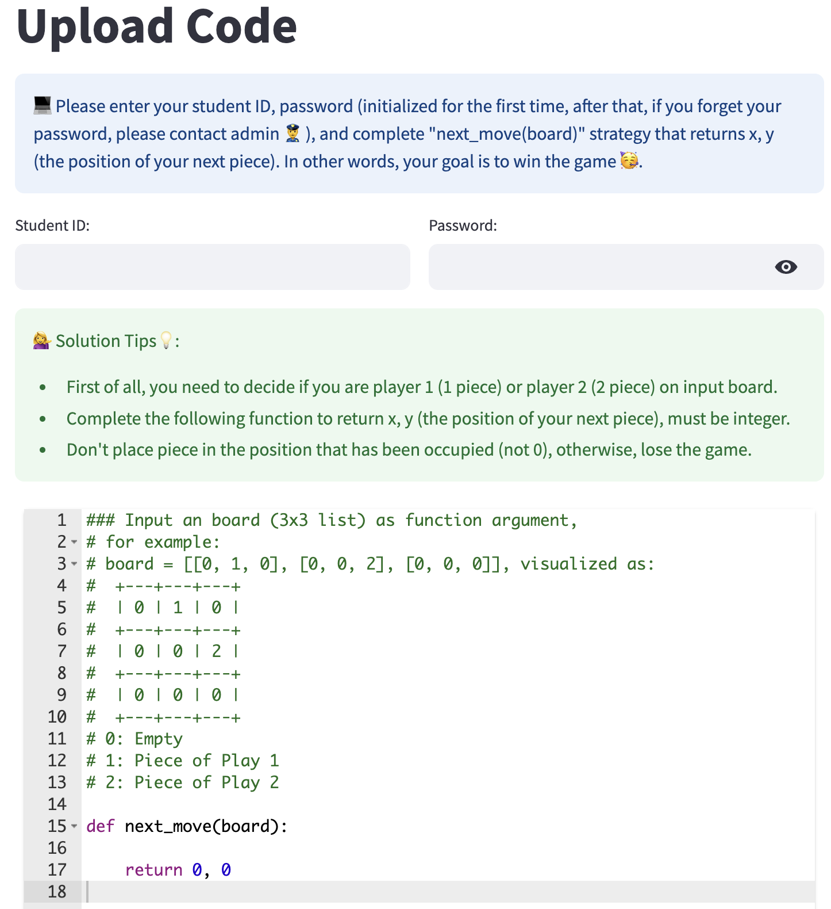
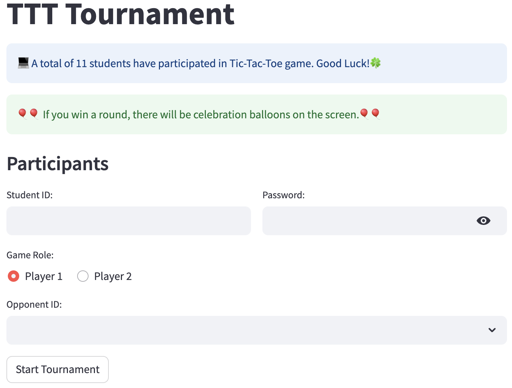
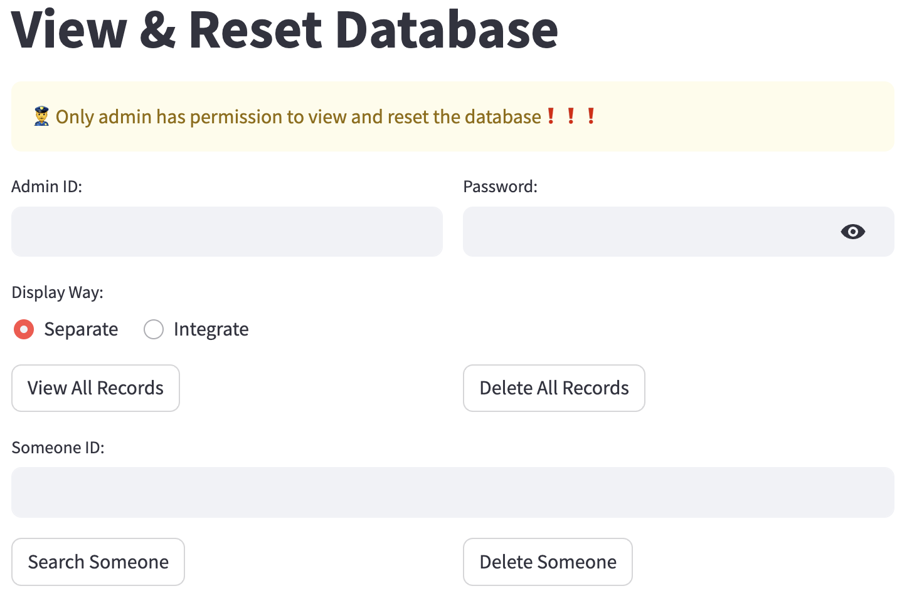
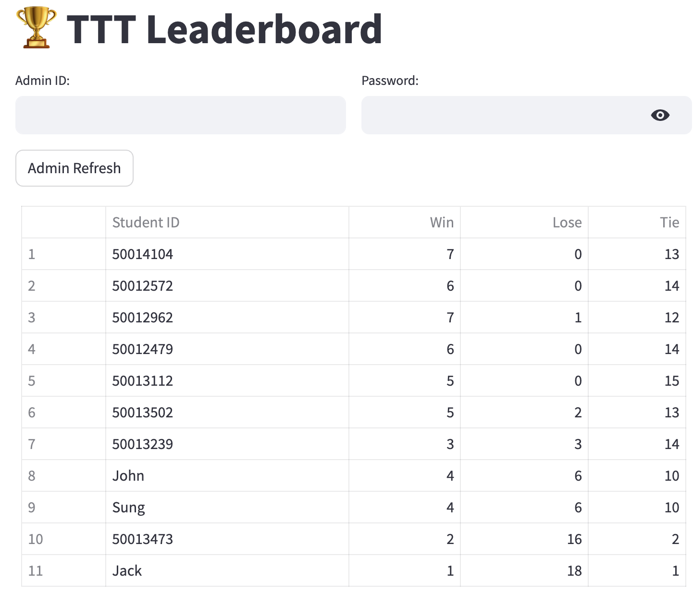

## Welcome to Tic-Tac-Toe Game
This app is made with [Streamlit](https://streamlit.io/). 
You can access our Tic-Tac-Toe Tournament platform at [https://tictactoe-john.streamlit.app](https://tictactoe-john.streamlit.app/home).

## Lunch Project
### Download Repository
```bash
git clone git@github.com:juyongjiang/tictactoe.git 
```
or `Click Download ZIP`

### Lunch Streamlit APP
```bash
touch .env
make 
make app
```

## Play Tic-Tac-Toe Game
### Step 1: Upload Code
<p align="center">
  
  <br>
</p>

:computer: Please enter your student ID, password (initialized for the first time, after that, if you forget your password, please contact admin :cop: ), and complete \"next_move(board)\" strategy that returns x, y (the position of your next piece). In other words, your goal is to win the game :partying_face:.

:information_desk_person: **Solution Tips**:bulb::
* First of all, you need to decide if you are player 1 (1 piece) or player 2 (2 piece) on input board.
* Complete the following function to return x, y (the position of your next piece), must be integer.
* Don't place piece in the position that has been occupied (not 0), otherwise, lose the game.

For example,

```python
### Input an board (3x3 list) as function argument, 
# for example:
# board = [[0, 1, 0], [0, 0, 2], [0, 0, 0]], visualized as:
#  +---+---+---+
#  | 0 | 1 | 0 |
#  +---+---+---+
#  | 0 | 0 | 2 |
#  +---+---+---+
#  | 0 | 0 | 0 |
#  +---+---+---+
# 0: Empty
# 1: Piece of Play 1 
# 2: Piece of Play 2 

def next_move(board):
    import random
    while True:
        x = random.randint(0, 2)
        y = random.randint(0, 2)
        if board[x][y] == 0:
            return x, y
    return 0, 0
```
### Step 2: Let's start!
<p align="center">
  
  <br>
</p>

**Tournament Results** 

> **Round 1: John vs Sung**

======> Start Playing <======

---------------1 Step 1 ---------------

👮‍♂️ John (X) => (0, 0) ✅
```bash
##  0   1   2
  +---+---+---+
0 | X |   |   |
  +---+---+---+
1 |   |   |   |
  +---+---+---+
2 |   |   |   |
  +---+---+---+
```
🥷 Sung (O) => (0, 1) ✅
```bash
##  0   1   2
  +---+---+---+
0 | X | O |   |
  +---+---+---+
1 |   |   |   |
  +---+---+---+
2 |   |   |   |
  +---+---+---+
```
---------------1 Step 2 ---------------

👮‍♂️ John (X) => (0, 2) ✅
```bash
##  0   1   2
  +---+---+---+
0 | X | O | X |
  +---+---+---+
1 |   |   |   |
  +---+---+---+
2 |   |   |   |
  +---+---+---+
```
🥷 Sung (O) => (1, 0) ✅
```bash
##  0   1   2
  +---+---+---+
0 | X | O | X |
  +---+---+---+
1 | O |   |   |
  +---+---+---+
2 |   |   |   |
  +---+---+---+
```
---------------1 Step 3 ---------------

👮‍♂️ John (X) => (1, 1) ✅
```bash
##  0   1   2
  +---+---+---+
0 | X | O | X |
  +---+---+---+
1 | O | X |   |
  +---+---+---+
2 |   |   |   |
  +---+---+---+
```
🥷 Sung (O) => (2, 0) ✅

```bash
##  0   1   2
  +---+---+---+
0 | X | O | X |
  +---+---+---+
1 | O | X |   |
  +---+---+---+
2 | O |   |   |
  +---+---+---+
```
---------------1 Step 4 ---------------

👮‍♂️ John (X) => (2, 2) ✅
```bash
##  0   1   2
  +---+---+---+
0 | X | O | X |
  +---+---+---+
1 | O | X |   |
  +---+---+---+
2 | O |   | X |
  +---+---+---+
```

```bash
The winner is 👮‍♂️ John!
```

**Tournament Standings** 

|   | Student ID	| Opponent Num | Win | Lose |	Tie|
|---|---|---|---|---|---|
|1	| John|	1	| 1 |	0 |	0|


### Step 3: Database Viewer & Operation (Admin :cop:)
Only admin can view and reset the database, if you need helps, please feel free to contact admin. 
<p align="center">
  
  <br>
</p>

### Step 4: Leaderboard
<p align="center">
  
  <br>
</p>
